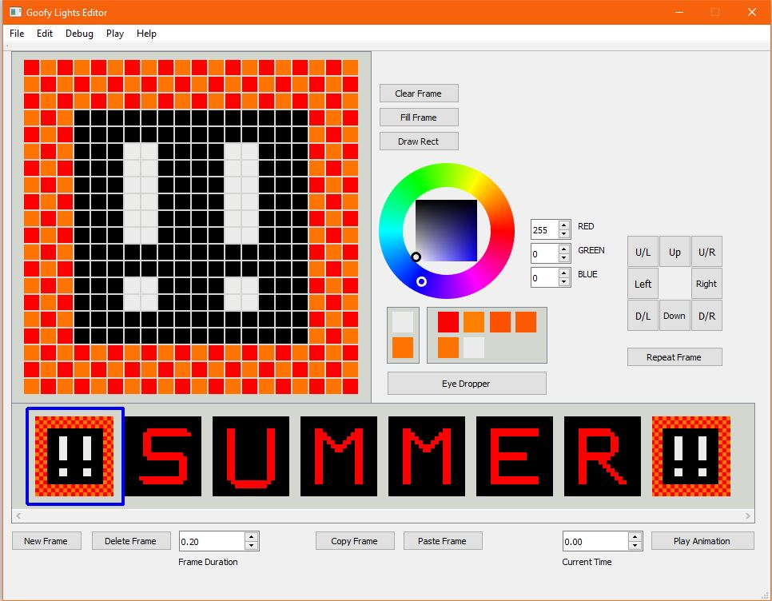

# Goofy_Lights_Editor (University of Idaho CS 383 Group Project)
## Spring 2016

### Team Members
Nick Krenowicz, Paul Martin, Tim Sonnen, Kevin Dorscher, Joe Carter, Lise Welch, and Emma Bateman
### Instructor
Bruce Bolden

# Task
Create a QT based program that can create a frame-by-frame animation for the Tower of Lights and the Goofy Glasses the marching band uses.

The [Tower of Lights](https://www.youtube.com/watch?v=hESMhgDnk4E) show is displayed on the theopolis tower on campus.

